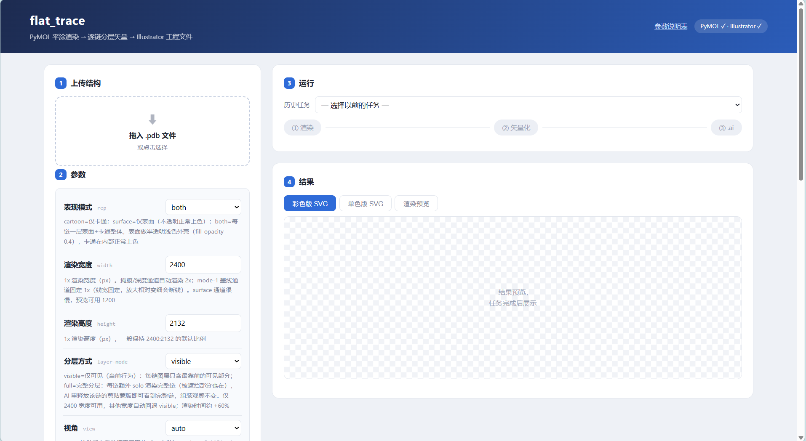
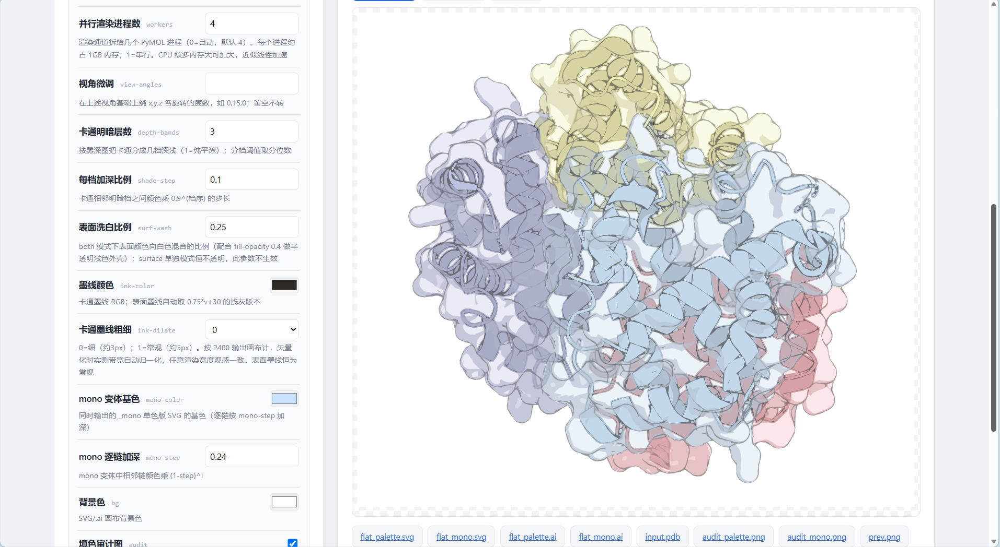
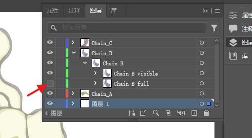

# PDB2Image — PyMOL平涂渲染 → 分层矢量管线

**PDB2Image 是干什么的**：画蛋白结构图时，PyMOL 的位图导出放大就糊、
 illustrator 手描又太费劲。PDB2Image 让 PyMOL 以无光影平涂方式渲染结构，
再把渲染结果**临摹成分层矢量图**——每条链是独立图层，填色、按雾深分档的
明暗、mode-1 墨线全部是真正的矢量路径，可无限放大、逐条链拖动、改色、
重排版，直接出 SVG / Adobe Illustrator 图，方便细节精修。

<p align="center">
  
</p>

- 三种表现模式：cartoon / surface / **both**（半透明表面壳 + 内部卡通）
- 多进程并行渲染，输出与串行逐字节一致
- **完整分层**（full layering）：每链携带一条隐藏的完整链图层（被遮挡
  部分也在），Illustrator 里点亮即可就地补全
- 附带本地网页工具：上传 PDB → 表单填参 → 实时进度 → 下载

> 😁 项目仍在不断改进中，接口和行为可能调整。遇到问题或想要新功能，
> 欢迎[提 issue](https://github.com/dredge071/PDB2Image/issues)；
> 欢迎提 PR 做贡献。

## 目录结构

| 位置 | 内容 |
|---|---|
| `render_flat.py` | 阶段① 渲染（PyMOL 环境运行）：输出各链掩膜、雾深图、mode-1 墨线、表面通道。通道拆分给多个 PyMOL 进程并行渲染（`--workers`，默认自动=4；`--workers 1` 串行），输出与串行逐字节一致 |
| `vectorize_flat.py` | 阶段② 矢量化（主 Python）：按链填色 + 按链墨线临摹 → `flat_palette.svg` / `flat_mono.svg` |
| `vec_core.py` | 描摹原语（trace_mask / svg_document 等），flat_trace 自包含，不依赖其他项目目录 |
| `protein2vector_flat.py` | 阶段③ .ai 导出：驱动本机 Illustrator（COM）转分层 .ai |
| `templates/ai_export_template.jsx` | Illustrator 导出用的 JSX 模板 |
| `webapp/` | **网站工具（推荐入口）**：上传 PDB → 表单 → 进度/预览/下载，见 `webapp/README.md` |
| `webapp/params.md` | 全部可调参数 + 内置固定参数的说明表（由 `webapp/params_spec.py` 生成） |
| `docs/full_layering_spec.md` | 完整分层功能的设计规格与实测结论 |

## 安装

### 方案一（推荐）：单个 conda 环境装完所有东西

PyMOL 和矢量化依赖装进**同一个** conda 环境（conda 会一并解好版本
兼容），之后渲染、矢量化、网站工具全用它，**无需设置任何环境变量**：

```bash
# 进入 flat_trace 目录（cd 到它里面，不是它的上级目录），
# 这样 ../pymol-env 正好落在仓库旁边，flat_trace 会自动找到它
cd flat_trace
conda create -p ../pymol-env -c conda-forge ^
    pymol-open-source flask python-multipart numpy opencv pillow pymupdf
```

不想 cd 的话，`-p` 直接写绝对路径也行（同样要求：位置在仓库旁边、
名为 pymol-env，才能被自动发现）：

```bash
conda create -p "D:\somewhere\pymol-env" -c conda-forge ^
    pymol-open-source flask python-multipart numpy opencv pillow pymupdf
```

然后双击 `webapp\start_web.bat` 即可（它会优先用旁边这个环境启动网站）。

### 方案二：两个环境分开

主 Python 环境（≥3.10）只装矢量化 + 网站依赖：

```bash
pip install -r webapp/requirements.txt
```

PyMOL 单独一个环境（名称位置随意）：

```bash
conda create -n pymol -c conda-forge pymol-open-source
```

渲染端解释器按以下顺序自动探测（两环境模式通常要设第 1 条）：

1. 环境变量 `FLAT_TRACE_PYMOL_PY` → PyMOL 环境的 python 可执行文件；
2. 当前解释器自己能 `import pymol` → 直接用它（即方案一的单环境模式）；
3. 仓库旁边的 `../pymol-env/python.exe`。

> 为什么 PyMOL 要独立：PyMOL 发行版自带一套特定版本的 numpy 等，直接
> pip 混装进现有环境容易互相污染；但方案一用 conda 在一个**新建**环境
> 里统一求解就没有这个问题。

**（可选）分层 .ai 导出**：仅 Windows + 已装 Adobe Illustrator（COM
接口）。不需要 .ai 时可完全忽略；网站会自动探测 Illustrator 是否真的
可用（个别安装缺少 COM 注册，此时 .ai 导出会给出明确提示，SVG 不受
影响）。

## 环境变量

两个都是**可选**的（单环境方案一不需要设任何变量）：

| 变量 | 作用 |
|---|---|
| `FLAT_TRACE_PYMOL_PY` | 渲染端解释器（PyMOL 环境的 python 可执行文件）。不设则按"当前解释器能 import pymol → 仓库旁 ../pymol-env"的顺序探测 |
| `FLAT_TRACE_PYTHON` | 网站工具的解释器（`start_web.bat` 使用；不设则先试旁边带 flask 的 pymol-env，再用 PATH 里的 python） |

## 快速开始

```
双击 webapp\start_web.bat            → http://127.0.0.1:5000
```

网页工具长这样——上传结构、填参数、点运行、看结果，四步一张页：

<p align="center">
  
</p>

跑起来后左边参数表单、右边实时预览和产物下载：

<p align="center">
  
</p>

### 网页工具推荐参数

| 目标 | 表现模式 | 渲染宽度 | 其他 | 大约耗时 |
|---|---|---|---|---|
| 快速预览 | cartoon | 1200 | 其余默认 | 5-20 分钟 |
| 标准成品 | both | 2400 | 其余默认；勾选"导出分层 .ai" | 15-40 分钟（视结构大小） |
| 标准成品 + 完整分层 | both | 2400 | 同上 + 分层方式 = full | 需要更长时间 |
| 单色风 | cartoon / both | 2400 | 勾选"单色模式" | 同标准成品 |

几点经验值（默认值即推荐值，都实测验证过）：

- **并行渲染进程数**：直接用页面上方资源检测给出的推荐值（每个进程约占 1GB 左右内存）；设 `1` = 串行；
- **视角**：3 链以上用 `auto`（按链质心自动摆正）通常效果就很好；不满意再用"视角微调"小角度转（如 `0,15,0`），暂时还没有在网页里加可视化旋转角度的功能，后面补上；
- **卡通墨线粗细**：`0`（细）正常出图选0就好；`1`（常规）会粗一点；
- **勾选"填色审计图"**可以检查红（超出轮廓）/黄（漏填），正常应接近全白；
- 明暗层次：卡通 3 档（depth-bands=3）+ 每档加深 0.10、表面洗白 0.25 是调好的默认组合，一般不用动。

命令行方式：

```bash
# ① 渲染（约数分钟；both 模式表面通道最慢；--layer-mode full 追加每链
#    solo 通道做完整分层，仅 2400 出成品时用，其他宽度自动回退）
python render_flat.py --pdb structure.pdb --out-dir out --rep both --width 2400

# ② 矢量化（输出画布固定 2400 规范空间；--layer-mode full 与渲染端一致）
python vectorize_flat.py --renders-dir out ^
    --chains A,B,C --out-prefix out/flat --rep both

# ③ 导出分层 .ai（需本机 Illustrator；①用了 --layer-mode full 时这里
#    的 SVG 已含隐藏的完整链图层）
python protein2vector_flat.py --out-dir out ^
    --svgs out/flat_mono.svg,out/flat_palette.svg --layers Chain_A,Chain_B,Chain_C
```

## 三种表现模式

| | cartoon | surface | both |
|---|---|---|---|
| 画的是什么 | 卡通（螺旋/折叠/环），按雾深分档平涂 | 分子表面壳（溶剂可及表面），不透明正常上色 | 半透明浅色表面壳罩在正常上色的卡通外 |
| 看到什么 | 最干净的二级结构示意 | 整体轮廓、结合面、口袋形状 | 轮廓和内部结构同时可见（经典封面图风格） |
| 图层结构 | 每链一层，层内 `Chain X cartoon` | 每链一层，层内 `Chain X surface` | 每链一层，层内 `Chain X surface`（上）+ `Chain X cartoon`（下） |

各模式相关参数（网站表单 / CLI 同名）：

- **cartoon 与 both 的卡通部分**：`depth-bands`（明暗档数，默认 3；1 = 纯平涂）、
  `shade-step`（每档加深比例，默认 0.10）、`ink-color` / `ink-dilate`（墨线颜色与粗细）；
- **both 的表面壳**：`surf-wash`（表面颜色向白色混合的比例，默认 0.25，配合
  固定的 fill-opacity 0.4 半透明；surface 单独模式恒不透明，此参数不生效）；
- 表面墨线自动取墨线颜色的浅灰版本，恒为常规粗细；
- 每种模式都同时输出**彩色版** `flat_palette.svg` 和**单色版** `flat_mono.svg`
  （单色按链逐条加深，勾选"单色模式"则主版直接单色）。

## both模式完整分层（full layering）

普通分层（visible）里，每链图层只包含它"最靠前可见"的部分——拖开一层，
被别的链挡住的部位是缺的。`分层方式 = full` 时，每链额外多做一次
**单独渲染**（场景里只留这一条链，相机完全不动），于是被遮挡的填色、
明暗、墨线、半透明表面壳全部都有，作为 `Chain X full` 子组收进该链图层，
**默认隐藏**。Illustrator 里长这样（红箭头处就是默认不显示的 `Chain B full`，点击后显示）：

<p align="center">
  
</p>

使用方法：

1. **就地补全**：点亮 `Chain X full` 的眼睛，这条链被遮挡的部位立即补齐
   （cartoon 模式下该部位位于其他链的不透明卡通之下，需拖出或隐藏其他链才可见；
   both 模式下透过半透明壳直接可见）；
2. **拖出完整链**：把整个 Chain X 图层拖出图层面板，就是一条填色、明暗、
   墨线、（both 的话）半透明壳俱全的**完整链**，随意摆放、改色、做爆炸图；
3. 组装态（什么都不动）与 visible 模式**逐字节一致**，发布前不需要做任何处理。

限制与细节：完整分层只在**渲染宽度 2400** 出成品时可用（其他宽度自动回退
visible 并在日志说明），渲染时间比较长；设计取舍的完整记录见
`docs/full_layering_spec.md`。

## 依赖小结

- 渲染：独立 PyMOL 环境（PyMOL 3.x；本管线会多进程并行调用，`--workers 1` 退回串行）
- 矢量化 / 网站：numpy、opencv-python、pillow、pymupdf、flask（见 `webapp/requirements.txt`）
- .ai 导出：Windows + 本机 Adobe Illustrator（COM）；导出结束后自动关闭 Illustrator
- 自包含：`vec_core.py` 内置全部描摹原语，仓库不依赖其他项目目录

## 路线图

- [ ] 网页内**可视化旋转角度**：用 3D 预览 / 滑杆直接调视角，替代手填
  `view-angles` 度数（目前的临时办法：先跑 1200 快速预览，改"视角微调"
  反复试）；
- [ ] 发布 release 后自动挂 Zenodo DOI，让"引用"可以精确到版本。

## 引用

如果 PDB2Image 对你的工作有帮助，欢迎在成果中引用它：

> dredge071. PDB2Image: from flat-shaded PyMOL renders to layered
> vector (SVG / Adobe Illustrator) figures of protein structures.
> https://github.com/dredge071/PDB2Image

（GitHub 仓库首页的 "Cite this repository" 按钮可直接导出 BibTeX。）

## 许可证

见 [LICENSE](LICENSE)。
