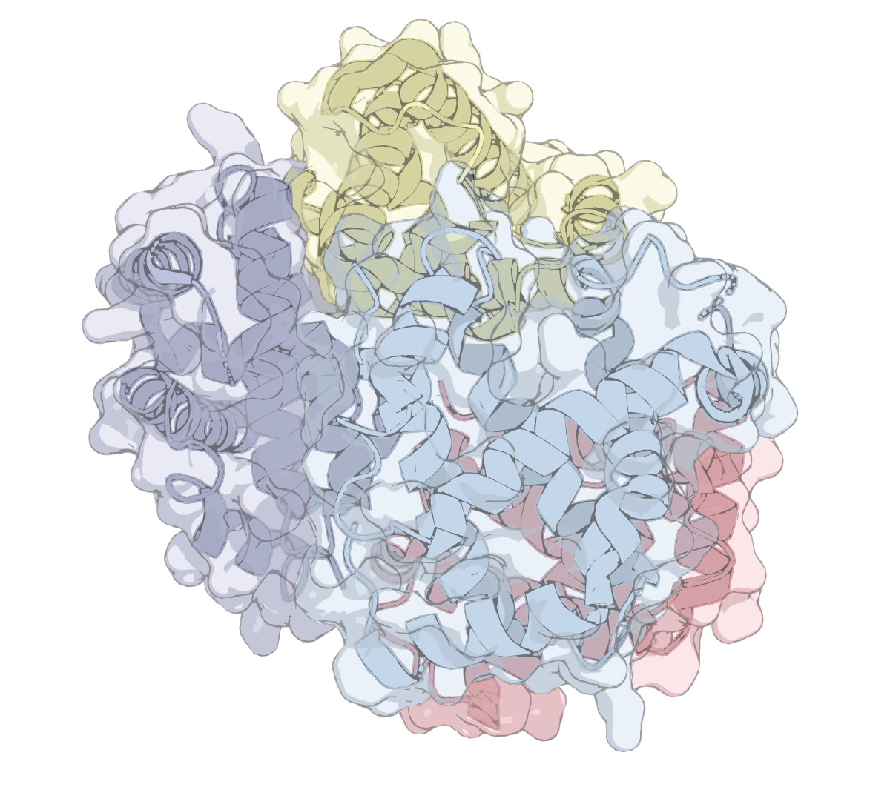

# flat_trace — PyMOL 平涂渲染 → 分层矢量 管线

<p align="center">
  
</p>

**flat_trace 是干什么的**：画蛋白结构图时，PyMOL 的位图导出放大就糊、
 illustrator 手描又太费劲。flat_trace 让 PyMOL 以无光影平涂方式渲染结构，
再把渲染结果**临摹成分层矢量图**——每条链是独立图层，填色、按雾深分档的
明暗、mode-1 墨线全部是真正的矢量路径，可无限放大、逐条链拖动、改色、
重排版，直接出出版级 SVG / Adobe Illustrator 成品。

- 三种表现模式：cartoon / surface / **both**（半透明表面壳 + 内部卡通）
- 多进程并行渲染，输出与串行逐字节一致
- **完整分层**（full layering）：每链携带一条隐藏的完整链图层（被遮挡
  部分也在），Illustrator 里点亮即可就地补全
- 附带本地网页工具：上传 PDB → 表单填参 → 实时进度 → 下载

> ⚠️ 项目仍在不断改进中，接口和行为可能调整。遇到问题或想要新功能，
> 欢迎[提 issue](https://github.com/dredge071/flat_trace/issues)；
> 欢迎提 PR 做贡献。

## 目录结构

| 位置 | 内容 |
|---|---|
| `render_flat.py` | 阶段① 渲染（PyMOL 环境运行）：输出各链掩膜、雾深图、mode-1 墨线、表面通道。通道拆分给多个 PyMOL 进程并行渲染（`--workers`，默认自动=4；`--workers 1` 串行），输出与串行逐字节一致 |
| `vectorize_flat.py` | 阶段② 矢量化（主 Python）：按链填色 + 按链墨线临摹 → `flat_palette.svg` / `flat_mono.svg` |
| `vec_core.py` | 描摹原语（trace_mask / svg_document 等），flat_trace 自包含，不依赖其他项目目录 |
| `protein2vector_flat.py` | 阶段③ .ai 导出：驱动本机 Illustrator（COM）转分层 .ai |
| `templates/ai_export_template.jsx` | Illustrator 导出用的 JSX 模板 |
| `webapp/` | **网站工具（推荐入口）**：上传 PDB → 表单 → 进度/预览/下载，见 `webapp/README.md` |
| `webapp/params.md` | 全部可调参数 + 内置固定参数的说明表（由 `webapp/params_spec.py` 生成） |
| `docs/full_layering_spec.md` | 完整分层功能的设计规格与实测结论 |

## 安装

1. **主 Python 环境**（矢量化 + 网站工具，≥3.10）：

   ```bash
   pip install -r webapp/requirements.txt
   ```

2. **PyMOL 环境**：渲染在独立的 PyMOL 环境中运行（与主环境隔离，
   因为 PyMOL 自带一套特定版本的 numpy 等）。推荐用 conda 装开源版：

   ```bash
   # 方式 A（零配置）：把环境建在仓库旁边、命名为 pymol-env，
   # flat_trace 会自动找到 ../pymol-env/python.exe
   cd <flat_trace 所在目录>
   conda create -p ../pymol-env -c conda-forge pymol-open-source

   # 方式 B：环境建在任意位置（如常规的 conda env），手动指定路径
   conda create -n pymol -c conda-forge pymol-open-source
   # 然后设置环境变量（Windows 示例）：
   #   set FLAT_TRACE_PYMOL_PY=%CONDA_PREFIX%\envs\pymol-env\python.exe
   ```

   已有能 `import pymol` 的 Python 环境（如官方安装版）也可以直接把
   它的 python 路径填给 `FLAT_TRACE_PYMOL_PY`，无需 conda。

3. **（可选）分层 .ai 导出**：仅 Windows + 已装 Adobe Illustrator
   （COM 接口）。不需要 .ai 时可完全忽略。

## 环境变量

| 变量 | 作用 |
|---|---|
| `FLAT_TRACE_PYMOL_PY` | 渲染端解释器（PyMOL 环境的 python.exe）。默认找仓库旁的 `../pymol-env/python.exe` |
| `FLAT_TRACE_PYTHON` | 网站工具的解释器（`start_web.bat` 使用；不设则用 PATH 里的 python） |

## 快速开始

```
双击 webapp\start_web.bat            → http://127.0.0.1:5000
```

命令行方式：

```bash
# ① 渲染（约数分钟；both 模式表面通道最慢；--layer-mode full 追加每链
#    solo 通道做完整分层，仅 2400 出成品时用，其他宽度自动回退）
python render_flat.py --pdb structure.pdb --out-dir out --rep both --width 2400

# ② 矢量化（输出画布固定 2400 规范空间；--layer-mode full 与渲染端一致）
python vectorize_flat.py --renders-dir out ^
    --chains A,B,C --out-prefix out/flat --rep both

# ③ 导出分层 .ai（需本机 Illustrator；①用了 --layer-mode full 时这里
#    的 SVG 已含隐藏的完整链图层）
python protein2vector_flat.py --out-dir out ^
    --svgs out/flat_mono.svg,out/flat_palette.svg --layers Chain_A,Chain_B,Chain_C
```

## 完整分层（full layering）用法

`--layer-mode full`（网站表单"分层方式 → full"）时，每链图层内多一个
默认隐藏的 `Chain X full` 子组：该链单独渲染（其他链禁用、相机不变）
并描摹的**完整**链——被遮挡部分的填色、明暗、墨线、半透明表面壳俱全。
组装观感与 visible 模式逐字节一致；在 Illustrator 图层面板点亮
`Chain X full` 即可就地补全，拖出该链图层即得一条完整链。
设计细节与实测结论见 `docs/full_layering_spec.md`。

## 依赖小结

- 渲染：独立 PyMOL 环境（PyMOL 3.x；本管线会多进程并行调用，`--workers 1` 退回串行）
- 矢量化 / 网站：numpy、opencv-python、pillow、pymupdf、flask（见 `webapp/requirements.txt`）
- .ai 导出：Windows + 本机 Adobe Illustrator（COM）；导出结束后自动关闭 Illustrator
- 自包含：`vec_core.py` 内置全部描摹原语，仓库不依赖其他项目目录

## 引用

如果 flat_trace 对你的工作有帮助，欢迎在成果中引用它：

> dredge071. flat_trace: from flat-shaded PyMOL renders to layered
> vector (SVG / Adobe Illustrator) figures of protein structures.
> https://github.com/dredge071/flat_trace

（GitHub 仓库首页的 "Cite this repository" 按钮可直接导出 BibTeX。）

## 许可证

见 [LICENSE](LICENSE)。
